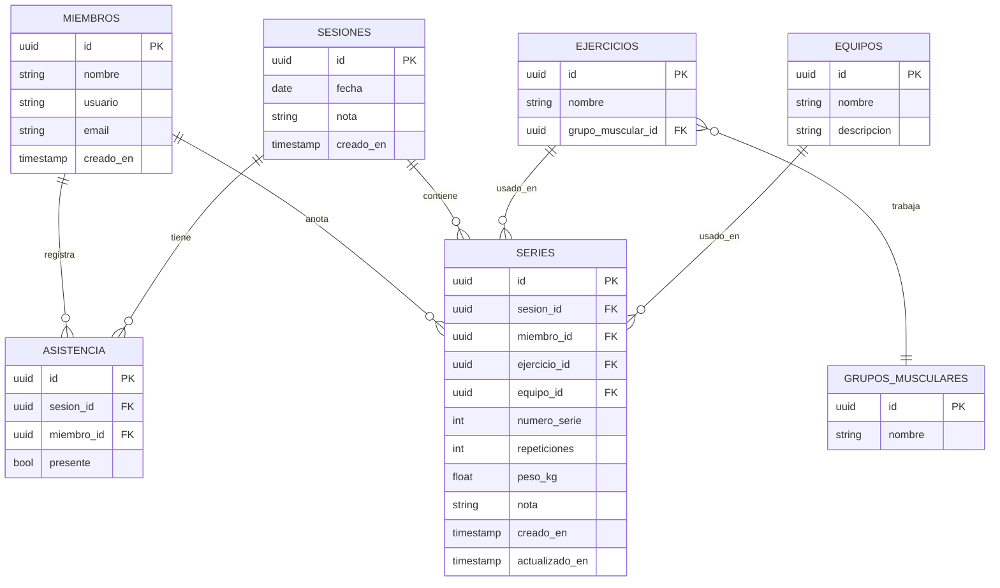

# FitCheck — Spec del proyecto

**Estado:** Borrador v1.6 — fuente de la verdad
**Última actualización:** 2026-09-12
**Propósito de este documento:** contexto de entrada para cualquier trabajo futuro (desarrollo, IA, onboarding de colaboradores) sobre el proyecto. Toda decisión de arquitectura, modelo de datos o alcance debería quedar reflejada aquí antes de darse por válida.

---

## 1. Resumen ejecutivo

FitCheck es una app para un grupo cerrado de compañeros de entrenamiento que quieren registrar, de forma colaborativa, lo que hace cada uno en cada sesión: qué grupos musculares se trabajaron, qué equipos se usaron, y las repeticiones/peso de cada serie. Los datos se sincronizan entre todos los perfiles al terminar el entreno, de modo que cualquier miembro puede consultar el historial completo del grupo — incluyendo quién no asistió a una sesión o quién no usó un equipo determinado.

Todos los usuarios objetivo usan iPhone. El entregable inicial es una PWA construida con Vue 3, instalable en pantalla de inicio, con posibilidad de evolucionar a app nativa vía Capacitor si el grupo lo necesita más adelante.

## 2. Objetivos y alcance

### 2.1 Objetivos (in-scope)
- Registrar sesiones de entrenamiento grupales, con fecha (hoy por defecto, o cualquier día anterior o posterior) y nota libre.
- Registrar, por sesión, qué miembros asistieron y cuáles no. Cualquier integrante puede marcar la asistencia de cualquier compañero.
- Registrar series individuales por miembro: ejercicio, grupo muscular (derivado del ejercicio), equipo usado, repeticiones, peso y marcas opcionales (chips). Quien anota elige a qué miembro del grupo se asigna la serie.
- Editar o borrar una serie ya guardada (el registro no es append-only).
- Consultar el historial: por miembro, por sesión, por grupo muscular, por equipo. La lista de sesiones está paginada y se filtra por fechas y grupo muscular.
- Responder preguntas negativas: "¿quién no asistió a la sesión X?", "¿quién no usó el equipo Y en la sesión X?".
- Sincronización entre todos los perfiles del grupo — un dato guardado por un miembro es visible por el resto sin fricción.
- UX optimizada para anotar entre series, con el móvil en mano: diseño moderno, muy intuitivo y cómodo en iPhone (una mano, entre series).
- Tema claro y oscuro, elegible por el usuario y persistido en el dispositivo.
- Catálogo de ejercicios, grupos musculares y equipos gestionable por el propio grupo, con un seed inicial único (sin nombres repetidos).
- Arranque del grupo: un integrante crea su cuenta, da de alta al resto (máx. 5) y el catálogo queda listo para el uso diario.

### 2.2 Fuera de alcance (v1)
- Multi-tenant / soporte para grupos de entrenamiento no relacionados entre sí (se asume un único grupo cerrado).
- Integración automática con el catálogo de equipos de Fitness Park (no existe API pública — ver sección 8).
- Planificación/programación de rutinas futuras (esto es un registro histórico, no un planificador). Registrar una sesión en una fecha futura es el mismo log que hoy — no una rutina programada.
- Métricas avanzadas (progresión de fuerza, gráficas de tendencia) — puede añadirse en fase posterior, no es v1.
- Publicación en App Store (v1 es PWA instalable, no requiere revisión de Apple).
- Recuperación de contraseña por correo (el grupo se coordina en persona; un miembro puede resetear la de otro desde Ajustes).

### 2.3 Actores
- **Miembro (Integrante):** perfil individual del grupo. Entra con usuario y contraseña. Puede registrar asistencia y series de **cualquier** integrante (el login dice *quién anota*; el `miembro_id` de la fila dice *a quién se anota*). Puede leer el historial de todo el grupo. Puede dar de alta a otro integrante (hasta 5) y editar el catálogo.
- No hay rol de "administrador" diferenciado en v1. El primer miembro es especial solo porque el grupo está vacío; después, cualquier miembro puede invitar y gestionar catálogo.

### 2.4 Arranque (una vez) vs uso diario

1. Un integrante crea el grupo (nombre visible, usuario, contraseña).
2. Desde Ajustes da de alta al resto de compañeros (usuario + contraseña inicial, se comunican en persona).
3. El seed deja un catálogo inicial (grupos, equipos, ejercicios). El grupo lo amplía o edita si hace falta.
4. Operativa diaria: cualquiera entra con su usuario, abre Hoy (fecha de hoy por defecto) y registra. Puede cambiar el día para volcar un entreno de papel o completar uno incompleto. Puede anotar asistencia y series de todos, o solo las suyas; no hace falta que cada uno lleve el móvil.

## 3. Modelo de datos

### 3.1 Diagrama entidad-relación



### 3.2 Entidades — detalle

**MIEMBROS**
| Campo | Tipo | Notas |
|---|---|---|
| id | uuid, PK | igual a `auth.users.id` |
| nombre | string | nombre visible en la app |
| usuario | string, único | apodo de login, minúsculas `[a-z0-9_]{3,24}` |
| email | string, único | interno de Auth: `{usuario}@fitcheck.local` — no se muestra como correo real |
| creado_en | timestamp | |

**SESIONES**
| Campo | Tipo | Notas |
|---|---|---|
| id | uuid, PK | |
| fecha | date | |
| nota | string, opcional | texto libre ("pierna + hombro") |
| creado_en | timestamp | |

**ASISTENCIA** (tabla puente miembro↔sesión)
| Campo | Tipo | Notas |
|---|---|---|
| id | uuid, PK | |
| sesion_id | uuid, FK → SESIONES | |
| miembro_id | uuid, FK → MIEMBROS | |
| presente | bool | **decisión clave, ver 3.3** |

Restricción: única fila por combinación (sesion_id, miembro_id).

**GRUPOS_MUSCULARES**
| Campo | Tipo | Notas |
|---|---|---|
| id | uuid, PK | |
| nombre | string | único ignorando mayúsculas y espacios; ej. "Pecho" |

**EQUIPOS**
| Campo | Tipo | Notas |
|---|---|---|
| id | uuid, PK | |
| nombre | string | único ignorando mayúsculas y espacios |
| descripcion | string, opcional | |

**EJERCICIOS**
| Campo | Tipo | Notas |
|---|---|---|
| id | uuid, PK | |
| nombre | string | único ignorando mayúsculas y espacios |
| grupo_muscular_id | uuid, FK → GRUPOS_MUSCULARES | el grupo muscular queda implícito al elegir el ejercicio |

**SERIES** (el registro atómico de trabajo)
| Campo | Tipo | Notas |
|---|---|---|
| id | uuid, PK | |
| sesion_id | uuid, FK → SESIONES | |
| miembro_id | uuid, FK → MIEMBROS | |
| ejercicio_id | uuid, FK → EJERCICIOS | |
| equipo_id | uuid, FK → EQUIPOS | |
| numero_serie | int | orden automático dentro del ejercicio **y** equipo para ese miembro en esa sesión (serie 1, 2, 3…); no se edita a mano |
| repeticiones | int | |
| peso_kg | float | |
| nota | string, opcional | chips de la serie, combinables, unidas con " · " en este orden canónico: "Con ayuda", "Fallo muscular", "Rest-pause", "Myo-reps", "Dropset / serie descendente", "Doble dropset", "Repeticiones forzadas", "Repeticiones negativas", "Rest-pause + dropset" |
| creado_en | timestamp | |
| actualizado_en | timestamp | se actualiza al editar la serie |

### 3.3 Decisión clave: por qué existe la tabla ASISTENCIA

Se decidió modelar la asistencia como tabla explícita en lugar de inferirla de la presencia/ausencia de filas en SERIES, por una razón concreta: la ausencia de registros en SERIES es ambigua. Un miembro puede haber asistido a la sesión y no haber usado un equipo concreto (dato real y relevante), o puede simplemente no haber estado presente (otro dato distinto). Sin ASISTENCIA como tabla propia, no se puede distinguir entre ambos casos con una consulta fiable.

Regla de negocio derivada: las preguntas de tipo "¿quién no usó el equipo X?" solo tienen sentido evaluadas sobre miembros con `presente = true` en esa sesión. Comprobar primero asistencia, luego ausencia de uso.

## 4. Arquitectura

### 4.1 Capas

```
┌─────────────────────────────────────────┐
│  Cliente: Vue 3 (PWA) en iPhone          │
│  - Pinia (estado)                        │
│  - Supabase JS client                    │
└───────────────┬───────────────────────────┘
                │ HTTPS / WebSocket (realtime)
┌───────────────▼───────────────────────────┐
│  Supabase                                │
│  - Postgres (modelo de datos de sec. 3)  │
│  - Auth (usuario + contraseña)           │
│  - Edge Function alta de miembros        │
│  - Realtime (cambios propagados en vivo) │
│  - Row Level Security (permisos)         │
└─────────────────────────────────────────┘
```

### 4.2 Por qué Supabase y no otra opción

- El modelo de datos (sección 3) es puramente relacional con múltiples FKs y consultas de tipo "quién no hizo X" — esto encaja mejor en SQL/Postgres que en una base NoSQL tipo Firestore, donde ese tipo de consulta relacional es incómodo.
- Incluye realtime nativo: cuando un miembro guarda una serie, el resto del grupo la ve sin refrescar la app.
- Row Level Security permite reglas de permisos a nivel de fila (solo el grupo cerrado escribe; cualquier integrante puede anotar series y asistencia de cualquiera) sin backend propio que mantener.
- Capa gratuita cubre de sobra el volumen de datos de un grupo de amigos.
- Alternativas descartadas: Firebase/Firestore (peor ajuste relacional para este modelo), backend propio con Node+Postgres (más trabajo de mantenimiento sin beneficio claro para este alcance).

### 4.3 Por qué Vue 3 como PWA y no app nativa directamente

- Vue 3 (con Pinia para estado y el cliente JS de Supabase) es suficiente como capa de interfaz — la sincronización real la resuelve Supabase, no el framework de frontend.
- Instalar como PWA ("Añadir a pantalla de inicio" desde Safari en iPhone) da una experiencia casi nativa (pantalla completa, icono propio) sin pasar por App Store: sin cuenta de desarrollador Apple, sin revisión, sin coste de $99/año.
- Ruta de evolución: si más adelante se necesitan notificaciones push nativas o distribución más amplia, el mismo código Vue se envuelve con **Capacitor** para generar un build nativo iOS, reutilizando la base existente.
- Se descartó React Native / Flutter por sobrecoste de aprendizaje y de mantenimiento sin necesidad clara en v1.

### 4.4 Estrategia de sincronización

- Cada escritura (serie, asistencia) se guarda directamente contra Supabase vía el cliente JS — no hay servidor intermedio propio.
- Los demás clientes conectados reciben el cambio vía canal realtime de Supabase (WebSocket) y actualizan su vista sin acción del usuario.
- **Carga:** Hoy trae catálogo, miembros y la sesión de la fecha seleccionada (por defecto hoy). El historial pide páginas al servidor (no se descarga el histórico entero).
- **Offline:** v1 asume conexión a internet disponible durante el entreno (gimnasio con wifi/datos). No se implementa cola offline-first en v1; si se detecta que hace falta (mala cobertura en el gimnasio), se añade como mejora de fase 2 usando IndexedDB local + reintento de sync.
- **Conflictos:** cada serie tiene un `miembro_id` (a quién se anotó el trabajo), no un “dueño de escritura”. Cualquier integrante del grupo puede insertar, editar o borrar cualquier serie o fila de asistencia. Si dos personas editan la misma fila a la vez, gana la última escritura (last-write-wins vía `actualizado_en`). No se requiere resolución de conflictos más compleja en v1.

## 5. Catálogo de equipos y ejercicios

No existe una API pública de Fitness Park (ni de ninguna cadena de gimnasios habitual) que exponga el inventario de máquinas por club — se confirmó buscando en sus canales oficiales, que solo listan marcas genéricas de equipamiento (Technogym, Eleiko, Hammer Strength, gym80, Nike Strength) sin catálogo consultable.

Decisión: hay un **seed inicial** con un juego correcto (Pecho, Espalda, Pierna, Hombro; Barra, Mancuernas, Máquina press, Polea; Press banca, Aperturas, Remo con barra, Jalón al pecho, Sentadilla, Prensa, Press militar). Ese seed es **idempotente**: nombres únicos (case-insensitive); si dos clientes arrancan a la vez, no se duplica. Después el grupo amplía o edita el catálogo a mano. No hay dependencia externa ni sincronización con terceros.

La gestión en Ajustes no usa chips aglomerados: Equipos, Ejercicios y Grupos musculares comparten una **lista filtrable de altura fija** (sec. 6.6). Si un ítem ya está en series, no se puede borrar.

## 6. UX — flujos principales

### 6.0 Flujo de cuenta
1. Si el grupo está vacío: pantalla **Crear el grupo** (nombre, usuario, contraseña).
2. Si ya hay equipo: pantalla **Entrar** (usuario, contraseña). Sin enlace de correo.
3. En Ajustes hay dos pestañas (mismo patrón que Historial): **Catálogo** (equipos, ejercicios, grupos musculares, apariencia, instalar PWA) y **Users** (listar compañeros, invitar, cambiar la propia contraseña, resetear la de otro, cerrar sesión). Sin cambio de reglas de negocio.

### 6.1 Flujo de sesión
1. En Hoy, la fecha por defecto es hoy. Se cambia con el selector (día anterior / fecha / día siguiente; **Ir a hoy** si no es el día actual). Si ese día no tiene sesión, se crea (nota opcional); quien la crea queda marcado presente. Si ya hay sesión, se continúa anotando. Tras crear, se permanece en ese día.
2. Asistencia **de grupo**: en cada fila hay Sí/No. Cualquier integrante puede marcar presente o ausente a cualquier compañero (una vez al empezar, no por ejercicio). Quien aún no tiene fila aparece como «sin marcar», distinto de ausente.
3. Durante el entreno se registran series eligiendo **a qué miembro** se anotan (chips de nombres; por defecto el logueado). Flujo: miembro → **ejercicio con filtro de búsqueda** (el grupo muscular se infiere) → equipo → repeticiones y peso con +/- grandes (tap o mantener pulsado) → chips opcionales de marcas (sec. 3.2) → guarda. Al guardar una serie, si ese miembro no está `presente`, se marca presente. Sigue pudiéndose marcar ausente a mano después. El selector de ejercicio incluye un **campo de búsqueda** que filtra por nombre en tiempo real, facilitando encontrar el ejercicio deseado cuando el catálogo es extenso.
4. Las series guardadas se listan agrupadas por **ejercicio + equipo** (p. ej. Press banca con máquina es un grupo distinto de Press banca con barra). Cada grupo es un acordeón: cabecera con el ejercicio, el equipo y el recuento; al abrir, cada SET con steppers de reps/peso y **Duplicar**. Duplicar copia ejercicio, equipo, reps y peso de esa serie **de ese miembro**; la nota no se copia (queda vacía). No hay botón global «Repetir última».
5. Una serie ya guardada se puede editar (reps y peso en el SET, o ejercicio/equipo/nota en la hoja) o borrar, **aunque la haya anotado otro**. El editor también usa el **selector de ejercicio con filtro**. El `numero_serie` es automático (1, 2, 3… por ejercicio, equipo y miembro en esa sesión): no se edita a mano. Tras borrar o al cambiar de grupo, se reordenan para que no queden huecos.
6. Los demás miembros ven altas, ediciones y borrados en tiempo real si están en la app simultáneamente.

### 6.2 Flujo de consulta
- Lista de sesiones paginada (p. ej. 15 por página), con filtros de **desde / hasta** y **grupo muscular**. Cabecera de frecuencia: cuántas sesiones del filtro tocan ese grupo en el rango.
- Vista por sesión: lista de presentes, ausentes y sin marcar + series de esa sesión, agrupadas por miembro.
- Consulta negativa de equipo: quién, estando presente, no usó el equipo Y en la sesión X (regla de la sec. 3.3).
- Vista por miembro: historial de sus series, filtrable por grupo muscular, equipo o rango de fechas (consulta al servidor, no un dump en memoria).
- Vista por grupo muscular: quién lo ha trabajado y cuándo; análogo negativo «quién no lo trabajó» (pendiente; ver sec. 9). El filtro de historial ya cubre frecuencia de sesiones por grupo.

### 6.3 Principios de diseño (v1)

Contexto de uso: iPhone en el gimnasio, entre series, a menudo con una sola mano y poca atención. La interfaz prioriza **velocidad, claridad y toques grandes** por encima de densidad de información.

- **Mobile-first iPhone:** layouts de una columna, safe areas (notch / Dynamic Island / home indicator), tipografía legible a ~40 cm, contraste WCAG AA en claro y en oscuro.
- **Toques cómodos:** controles primarios (guardar, +/− de reps y peso, duplicar un SET, presente/ausente, día anterior/siguiente) con área táctil mínima de **44×44 pt**. Nada crítico depende de gestos ocultos. El stepper de reps/peso responde a un tap (un paso) y a **mantener pulsado**: tras **1 s** el valor avanza a ritmo constante hasta soltar.
- **Jerarquía obvia:** en la pantalla de registro, lo primero que se ve es la fecha de la sesión, el ejercicio activo, la serie actual y los controles de reps/peso. Historial, catálogo y ajustes quedan un tap más atrás.
- **Menos teclado:** selectores, steppers y chips en lugar de inputs de texto siempre que se pueda. El teclado para notas, login, altas de catálogo y el **filtro por nombre** del catálogo en Ajustes.
- **Feedback inmediato:** al guardar/editar/borrar, confirmación visual en < 1 s (toast o estado en la propia tarjeta). Acciones destructivas (borrar serie) piden confirmación breve, no un modal pesado.
- **Navegación simple:** barra inferior con 3 destinos como máximo (**Hoy / Historial / Ajustes**). Sin hamburger menu. El selector de fecha vive en Hoy (no es un destino extra de la barra). Crear sesión y registrar serie no deben estar a más de un tap desde “Hoy”. Dentro de Historial y de Ajustes hay pestañas de agrupación (no son destinos extra de la barra).
- **Estética moderna, no recargada:** superficies limpias, radios consistentes, sombras suaves, acento único (energía / entrenamiento), iconos reconocibles. Evitar ilustraciones decorativas que restan espacio a los controles.

### 6.4 Sistema visual

Tokens (CSS custom properties) para color, radio, espacio y tipo; los componentes no llevan hex hardcodeados. Así el cambio claro/oscuro es un cambio de tokens, no de pantallas distintas.

| Token | Uso |
|---|---|
| `--bg`, `--surface`, `--surface-2` | Fondo de app, tarjetas, filas elevadas |
| `--text`, `--text-muted` | Texto principal y secundario |
| `--accent` | Acciones primarias (guardar, presente, serie activa) y anillo de foco inset del filtro de catálogo |
| `--danger` | Borrar, ausente, errores |
| `--success` | Guardado ok, sincronizado |
| `--border` | Separadores sutiles |
| `--catalog-list-h` | Altura fija del viewport de cada lista de catálogo en Ajustes (240px, ~5 filas) |

Tipografía: sistema nativo iOS (`-apple-system` / `ui-sans-serif`) para que se sienta nativa y rinda bien. Números de reps/peso en tabular lining, tamaño destacado.

Componentes de referencia: selector de fecha en Hoy (anterior / date / siguiente, Ir a hoy), acordeón de series por ejercicio + equipo (SET con steppers compactos y Duplicar), stepper +/- grande (tap = un paso; mantener 1 s = avance constante), selector de miembro (chips de nombres), **selector de ejercicio con búsqueda** (trigger que abre dropdown con campo de búsqueda y lista filtrable de opciones), lista de asistencia con Sí/No en **todas** las filas, buscador/filtro compacto en historial, lista filtrable de catálogo en Ajustes (sec. 6.6), hoja inferior (bottom sheet) para editar ejercicio/equipo/nota o borrar una serie sin salir de la pantalla.

### 6.5 Tema claro y oscuro

El usuario **elige** el aspecto; no se fuerza un solo tema.

- Opciones: **Claro**, **Oscuro** y **Automático** (sigue el modo del iPhone via `prefers-color-scheme`).
- Por defecto: **Automático** (en el gym de noche el oscuro cansa menos; de día el claro es más legible).
- Persistencia: preferencia **local al dispositivo** (`localStorage`), no va a la base de datos. No es un dato de grupo.
- El interruptor vive en **Ajustes → Catálogo**, visible y de un tap (segmented control Claro / Oscuro / Auto). Cambio instantáneo, sin recargar.
- `theme-color` de la PWA y `color-scheme` CSS se actualizan con el tema activo para que Safari, la status bar y el splash no “parpadeen” al color contrario.
- Ambos temas se diseñan y prueban; el oscuro no es un invertido automático.

### 6.6 Catálogo en Ajustes (listas filtrables)

El catálogo crece (sobre todo equipos y ejercicios). Pintarlo como chips en `flex-wrap` infla la página y el scroll pasa a ser de **toda** la vista de Ajustes, poco usable en iPhone. Las acciones Editar/Quitar en un menú al tap/hover eran inestables.

**Componente reutilizable** (`CatalogList`) en las tres secciones de la pestaña **Catálogo**: Equipos, Ejercicios y Grupos musculares. Los chips de marcas de serie (Hoy) no cambian. La pestaña **Users** agrupa perfil, invitación y contraseñas (sec. 6.0); no hay reglas nuevas.

- **Filtro embebido** arriba del recuadro, fijo (no se mueve con las filas). Filtra por **nombre** (`title`), case-insensitive, locale `es`. El subtítulo se muestra (descripción del equipo; grupo muscular del ejercicio) pero no entra en el filtro. Cada sección tiene su query; no se comparte.
- **Altura fija** del viewport (`--catalog-list-h`: 240px). `overflow-y` solo en la lista. La página de Ajustes sigue haciendo scroll entre tarjetas de la pestaña activa; no entre cientos de chips.
- **Filas**, no chips: título + subtítulo a la izquierda; **Editar** y **Quitar** siempre visibles a la derecha, área táctil ≥ 44 pt. Se descartó seguir con chips dentro del recuadro y un híbrido chip-row: las filas se escanean y se tocan mejor.
- **Quitar** pide confirmación en dos toques (Quitar → Confirmar), igual que antes. Si el ítem ya está en series, el store bloquea el borrado.
- Formularios de **alta** debajo de cada lista, fuera del viewport. **Editar** abre la hoja inferior existente.
- Vacío: sin ítems («No hay equipos/ejercicios/grupos»); filtro sin coincidencias («Nada coincide»).
- **Foco del filtro:** anillo interior 2px `--accent` (`outline-offset: -2px`). El outline nativo del sistema se dibuja por fuera y el `overflow: hidden` del recuadro recorta el borde superior.

## 7. Seguridad y permisos

- Autenticación por **usuario y contraseña** vía Supabase Auth. El usuario es un apodo; internamente Auth usa `{usuario}@fitcheck.local`. No hay magic link en el uso diario (el SMTP integrado limita a ~2 emails/hora y no escala a 5 personas).
- Confirmación de correo desactivada. El login no envía email.
- Alta de compañeros: Edge Function con `service_role` (nunca en el cliente). El primer usuario (grupo vacío) puede crearse sin JWT; el resto solo lo invita un miembro autenticado. Tope 5.
- Un miembro autenticado inserta su fila en `miembros` solo si el grupo está vacío; después las altas van por la función.
- Lectura y escritura de datos de producto: solo si existe fila en `miembros` para `auth.uid()`.
- Row Level Security:
  - Lectura: cualquier **miembro** autenticado puede leer todas las tablas (grupo cerrado, confianza total en lectura).
  - Escritura en SERIES y ASISTENCIA: cualquier **miembro** autenticado puede insertar, editar y borrar filas de cualquier `miembro_id` del grupo (`private.es_miembro()`). Quien no es del grupo no escribe.
  - Escritura en catálogo (EQUIPOS, EJERCICIOS, GRUPOS_MUSCULARES): abierta a cualquier miembro autenticado (grupo pequeño, sin necesidad de rol admin diferenciado en v1).
- Cambio de contraseña: el dueño, logueado, con `updateUser`. Reset de otro: misma Edge Function, por un compañero. No hay “olvidé mi contraseña” por email.

## 8. Requisitos no funcionales

- Todos los dispositivos objetivo son iPhone → probar específicamente en Safari iOS (comportamiento de PWA, "add to home screen", políticas de service worker de iOS, que son más restrictivas que Android/Chrome).
- Tiempo de guardado de una serie: percibido como instantáneo (< 1s) en condiciones normales de red de gimnasio.
- Tamaño del grupo: **1 a 5 personas**. El diseño (RLS, realtime, catálogo compartido, sin rol admin) se dimensiona para ese rango; no se optimiza para multi-tenant ni para decenas de usuarios concurrentes.
- Interfaz usable con una mano en iPhone: targets ≥ 44 pt, contraste AA en tema claro y oscuro, respeto de safe areas.
- Cambio de tema (claro / oscuro / automático) percibido como instantáneo y persistente entre visitas.
- El historial no carga todas las series del grupo de una vez; las listas de sesiones van paginadas.

## 9. Roadmap / fases

**Fase 1 — MVP**

Hecho:
1. Esquema SQL en Supabase (tablas de la sección 3) + políticas RLS de la sección 7.
2. Vue 3 PWA: alta de sesión en cualquier fecha desde Hoy (hoy por defecto), asistencia de grupo, registro de series de cualquier miembro, con el sistema visual y los flujos de la sección 6.
3. Tema claro / oscuro / automático (sec. 6.5).
4. Catálogo editable de ejercicios/equipos/grupos musculares desde la propia app; seed inicial idempotente y nombres únicos; en Ajustes, listas filtrables de altura fija (sec. 6.6).
5. Consultas: vista por sesión (series agrupadas por miembro); quién no asistió / sin marcar; quién, estando presente, no usó un equipo.
6. Vista por miembro: historial filtrable por grupo muscular, equipo o rango de fechas.
7. Login usuario / contraseña, alta del grupo e invitación de compañeros.
8. Historial de sesiones paginado, con filtros de fecha y grupo muscular y recuento de frecuencia.
9. Selector de ejercicio con búsqueda para mejorar UX con catálogos extensos (v1.6).

Pendiente:
10. Instalación en los iPhones del grupo vía Safari (HTTPS ya está en https://fitcheck-silviowork89-4758.vercel.app).

**Fase 2 — mejoras**
10. Consulta por grupo muscular (además de equipo) a nivel de “quién no lo trabajó”.
11. Offline-first si la cobertura del gimnasio resulta ser un problema real.

**Fase 3 — opcional, bajo demanda**
12. Build nativo iOS vía Capacitor (App Store) si se necesita distribución más amplia o push notifications.
13. Métricas de progresión (fuera de alcance v1, ver sección 2.2).

## 10. Registro de decisiones (decision log)

| Decisión | Alternativa descartada | Motivo |
|---|---|---|
| Postgres/Supabase para el modelo de datos | Firestore/NoSQL | El modelo es relacional (FKs, consultas "quién no hizo X"); SQL encaja mejor |
| ASISTENCIA como tabla propia | Inferir asistencia de la ausencia de SERIES | Ambiguo: no distingue "no asistió" de "asistió pero no usó X" |
| Escritura de grupo en SERIES y ASISTENCIA | Solo el dueño de la fila (`miembro_id = auth.uid()`) | En el gym uno puede anotar a todos; el login identifica quién entra, no a quién se anota. «Sin marcar» ≠ ausente |
| PWA instalable en v1 | App nativa directa | Evita coste/fricción de App Store; Capacitor deja la puerta abierta para después |
| Catálogo de equipos manual + seed inicial único | Integración con API de Fitness Park; seed que se puede repetir | No existe API pública; el juego inicial es útil, las copias no |
| Sin offline-first en v1 | Cola offline con IndexedDB desde el inicio | Se asume conectividad en el gimnasio; se añade solo si se demuestra necesario |
| Sin rol admin diferenciado en v1 | Rol admin para gestionar catálogo | Grupo cerrado de 1–5 personas, no aporta valor en v1 |
| Series editables y borrables por cualquier miembro | Registro append-only, o solo el dueño edita | Corregir un peso/reps mal anotados es habitual; quien registra para el grupo también corrige |
| `numero_serie` automático, no editable a mano | Control para reordenar series en la hoja de edición | El orden es 1, 2, 3… por ejercicio **y** equipo; al borrar o cambiar de grupo se compacta. Editarlo a mano pelea con esa regla |
| Series en acordeón por ejercicio + equipo; duplicar el SET | Lista plana + botón global «Repetir última» | En el gym se encadenan series del mismo ejercicio/equipo; el atajo vive en el SET, no en el formulario |
| Chips de marcas por serie (ayuda, fallo y técnicas) | Campo de texto libre | En el gym se elige con un tap; se combinan libremente; se serializan con " · " en orden canónico; no bloquean el guardado |
| UI mobile-first con targets grandes y barra inferior | Dashboard denso tipo escritorio | El uso real es anotar entre series en el iPhone, no consultar en un portátil |
| Tema Claro / Oscuro / Auto, local al dispositivo | Un solo tema, o tema guardado en servidor | En el gym cambia la luz; cada móvil tiene su preferencia y no es un dato del grupo |
| Usuario + contraseña (email interno `@fitcheck.local`) | Magic link por correo | El SMTP integrado limita a ~2 emails/hora; con hasta 5 personas el login diario no puede depender del correo |
| Historial paginado con filtros | Cargar todas las sesiones y series al arrancar | A los pocos meses la lista es larga; hace falta buscar por fecha y ver frecuencia por grupo muscular |
| Catálogo en Ajustes como listas filtrables de filas | Chips en `flex-wrap`, o chips/híbrido dentro del recuadro | Al crecer el catálogo el scroll de página se vuelve inusable; las filas se escanean y se tocan mejor. Un componente sirve para equipos, ejercicios y grupos |
| Filtro de catálogo solo por nombre | Filtrar también por subtítulo (grupo muscular, descripción) | Se busca lo que el grupo nombra al ítem; el subtítulo es contexto, no clave |
| Scroll interno de altura fija en cada lista de catálogo | Dejar crecer la tarjeta de Catálogo | El scroll debe ser del componente que muestra los ítems, no de toda la vista de Ajustes |
| Anillo de foco inset (`--accent`) en el filtro | Outline nativo del sistema | `overflow: hidden` del recuadro recorta el borde superior del outline nativo |
| Selector de ejercicio con búsqueda (v1.6) | Select nativo o lista sin filtro | Al crecer el catálogo (20+ ejercicios) el scroll manual es lento; la búsqueda filtra en tiempo real y se cierra al elegir |
| Ajustes con pestañas Catálogo / Users | Cuarto destino en la barra inferior, o una sola pantalla larga | Solo agrupación visual; la barra sigue en 3 destinos (sec. 6.3). Users: cuentas; Catálogo: catálogo, apariencia e instalar PWA |
| Selector de fecha en Hoy (cualquier día) | Hoy solo carga el día local; alta de otra fecha invisible tras crear | Volcar histórico de papel y completar un día incompleto; no es un planificador (sec. 2.2). Si hay varias filas el mismo día, se muestra la más reciente |

## 11. Preguntas abiertas

Ninguna pendiente de la ronda inicial. Decisiones cerradas el 2026-09-04, 2026-09-05, 2026-09-07 y 2026-09-08:

- Tamaño del grupo: entre 1 y 5 personas.
- Una serie ya guardada se puede editar y borrar (no es append-only), por cualquier miembro del grupo.
- Nota por serie con chips combinables: Con ayuda, Fallo muscular, Rest-pause, Myo-reps, Dropset / serie descendente, Doble dropset, Repeticiones forzadas, Repeticiones negativas, Rest-pause + dropset.
- Diseño moderno, intuitivo y cómodo en iPhone (sec. 6.3–6.4).
- Tema claro, oscuro o automático, a elección del usuario (sec. 6.5).
- Asistencia y series de grupo: cualquiera marca y anota a cualquiera; al guardar una serie se marca presente a ese miembro (sec. 6.1 y 7).
- `numero_serie` automático por ejercicio **y** equipo: se editan reps, peso, equipo y nota; el número no se toca a mano (sec. 6.1).
- Listado de series en Hoy: acordeón por ejercicio + equipo; Duplicar en cada SET (nota vacía); sin botón «Repetir última» (sec. 6.1).
- Login con usuario y contraseña; sin magic link en el uso diario (sec. 7). El login no limita a quién se anota.
- Seed de catálogo inicial, una sola vez por nombre (sec. 5).
- Historial de sesiones paginado, filtrable por fechas y grupo muscular (sec. 6.2).
- Catálogo en Ajustes: listas filtrables de filas (no chips), filtro por nombre, altura fija y scroll interno; Editar/Quitar visibles; foco del filtro con anillo inset (sec. 6.6). Los chips de marcas de serie no cambian.
- Ajustes se agrupa en pestañas **Catálogo** y **Users** (sec. 6.0); sin cambio de reglas de negocio.
- Hoy es un workspace por fecha: por defecto hoy; se puede elegir un día pasado o futuro para crear o continuar esa sesión (sec. 6.1). No hay `UNIQUE` en `sesiones.fecha`.
